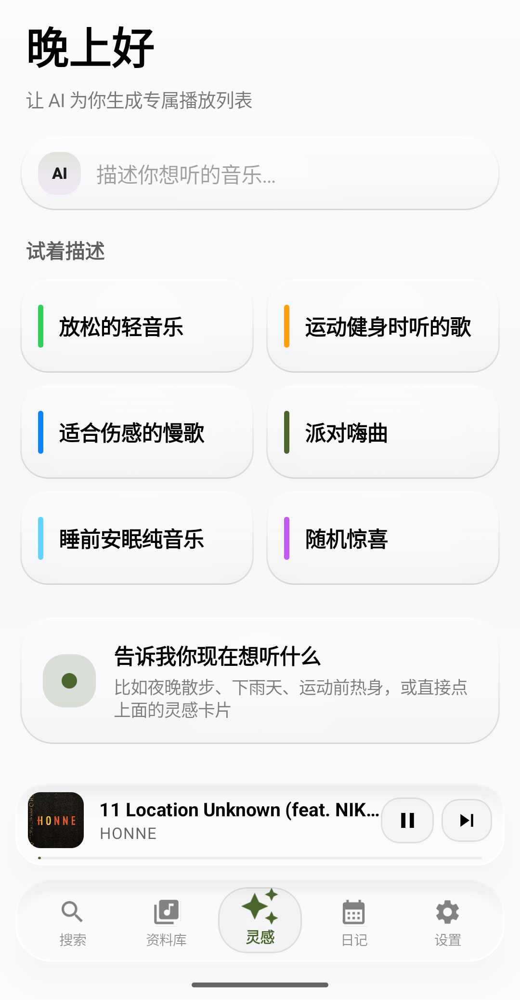
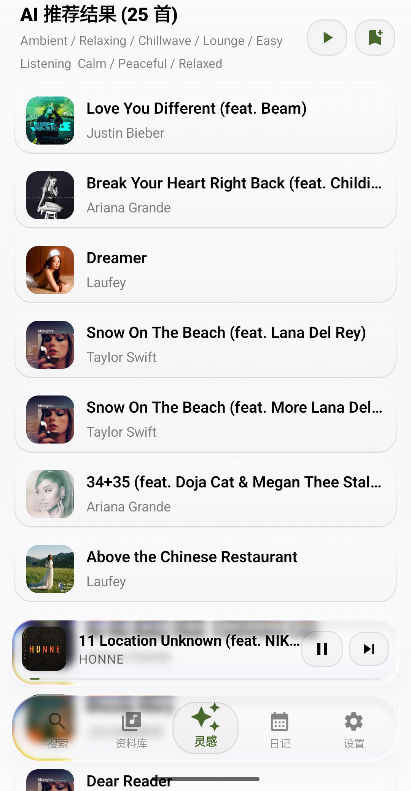
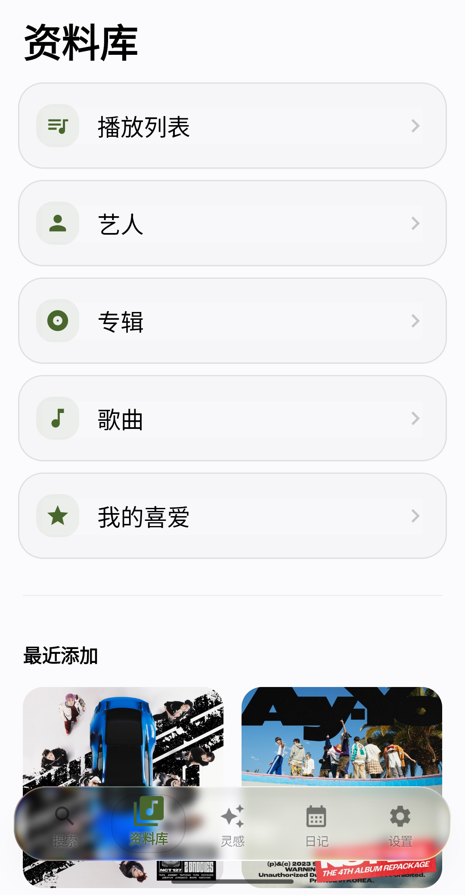
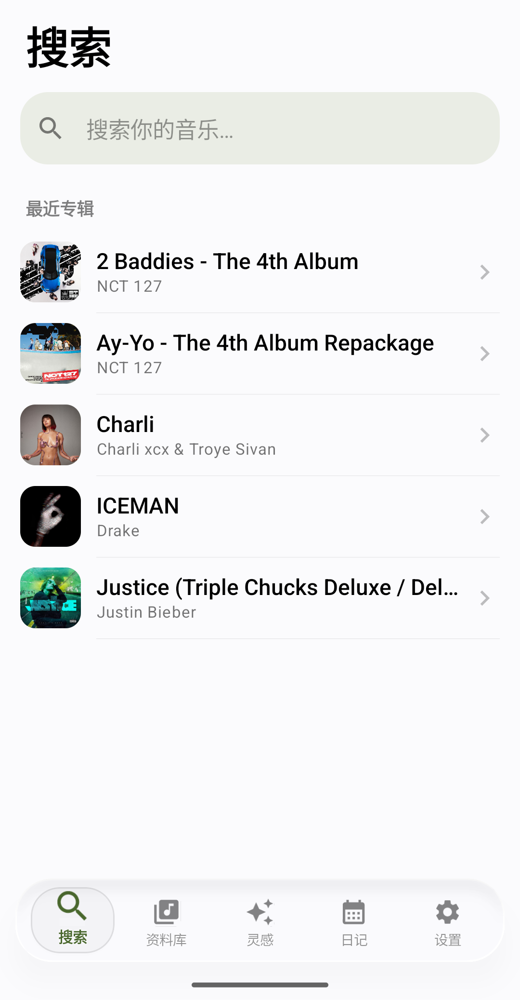
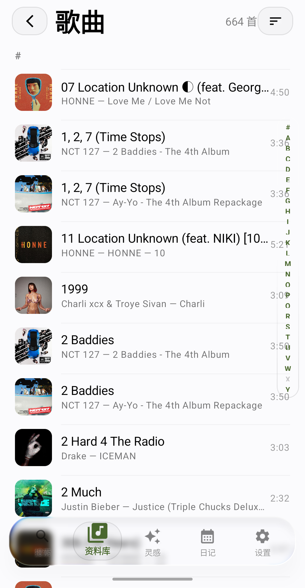
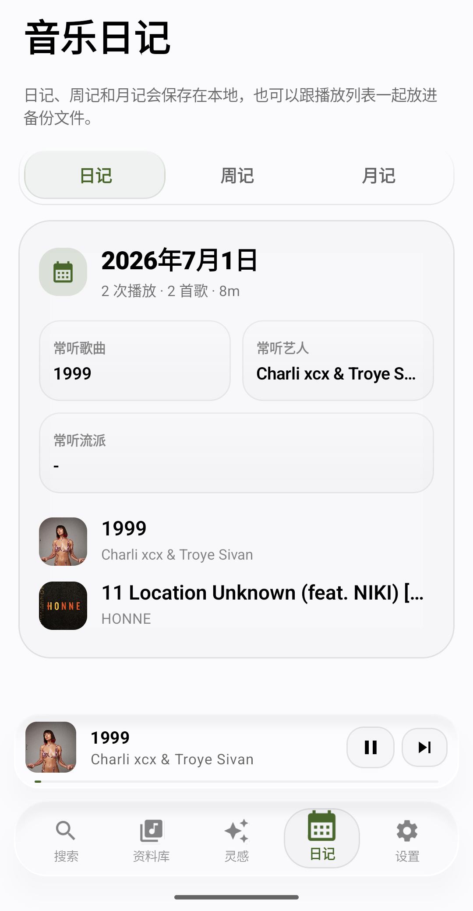
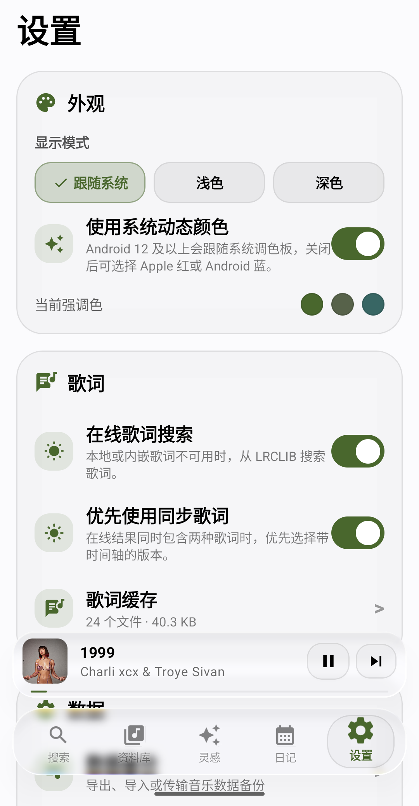
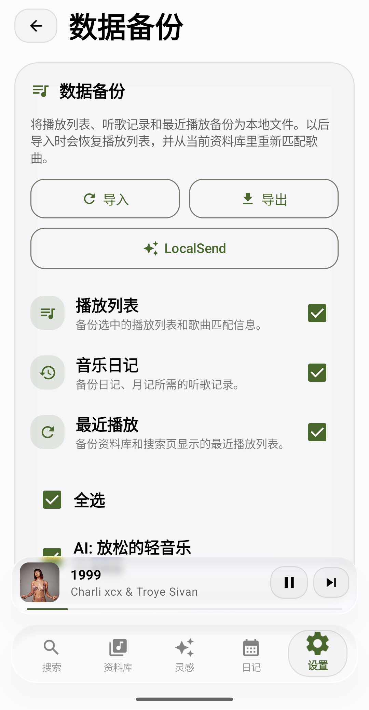
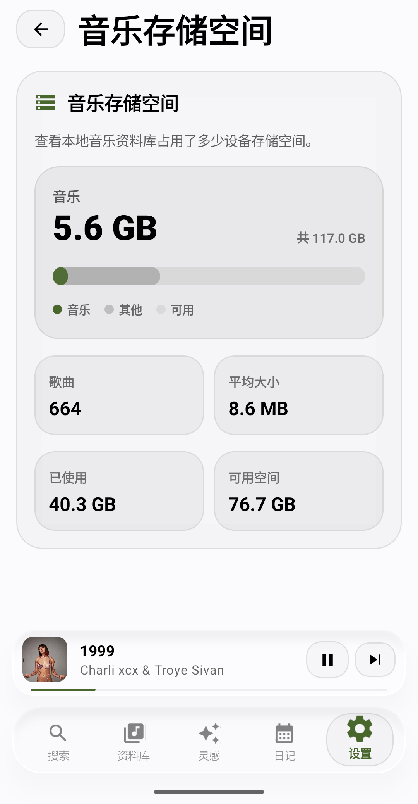
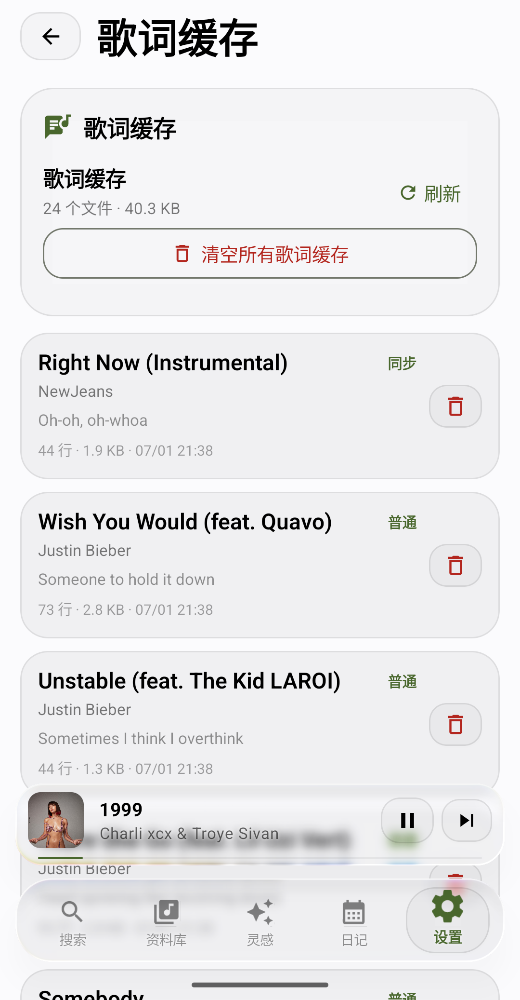

# 灵感音乐 / Inspire Music

> 把本地音乐做得更像一个会呼吸的小宇宙。  
> A local Android music player with Liquid Glass visuals, lyrics, diary, backups, and AI-powered listening inspiration.

## 下载

前往 [Releases](../../releases) 下载最新的 `InspireMusic-release.apk`。

如果安装时提示“软件包与已有软件包存在冲突”，通常是因为旧版本和新版本签名不同。请先卸载旧版一次，再安装最新版；之后使用固定签名的版本就可以正常覆盖更新。

## 灵感音乐从哪里来 ✨

灵感音乐一开始不是为了做一个“功能很多但很冷”的播放器。它更像是一个小小的音乐房间：你的专辑、播放列表、歌词、最近播放都被安静地收好；当你不知道听什么的时候，它也能根据一句话、一种心情、一个场景，递给你一份新的歌单灵感。

所以它叫“灵感音乐”。不是只负责播放，也负责在某个晚上、某段路上、某个突然想听歌的瞬间，帮你把音乐重新点亮。🎧

## 你会看到什么

- 🫧 **Liquid Glass 风格界面**：底栏、mini 播放器、按钮、卡片和设置页都尽量保持通透、柔和、轻盈。
- 🎵 **本地音乐资料库**：歌曲、专辑、艺人、播放列表、我的喜爱，一个地方收好。
- ✨ **AI 灵感歌单**：输入“放松的轻音乐”“运动健身时听的歌”“适合伤感的慢歌”，让 AI 从你的音乐里找方向。
- 📝 **音乐日记**：按日记、周记、月记回看最近听了什么，连“这段时间的自己”也能听见一点。
- 🎤 **歌词与缓存**：支持本地歌词、内嵌歌词、在线歌词搜索和歌词缓存管理。
- 💾 **数据备份**：播放列表、音乐日记、最近播放都可以导出、导入，也可以准备做设备间互传。
- 📦 **音乐存储空间**：像系统储存空间一样，看清本地音乐到底占了多少容量。
- 🔒 **本地优先**：核心播放、资料库、日记、缓存、备份都在本机完成；AI 和在线歌词是可选能力。

## 截图

| 灵感页 | AI 推荐 |
| --- | --- |
|  |  |

| 资料库 | 搜索 |
| --- | --- |
|  |  |

| 歌曲列表 | 音乐日记 |
| --- | --- |
|  |  |

| 设置 | 数据备份 |
| --- | --- |
|  |  |

| 音乐存储空间 | 歌词缓存 |
| --- | --- |
|  |  |

## 安装

1. 在 [Releases](../../releases) 下载最新 APK。
2. 在 Android 设备上打开 `InspireMusic-release.apk`。
3. 如果系统提示，请允许“安装未知来源应用”。
4. 首次启动后授予音乐 / 媒体访问权限。

## AI 与隐私

灵感音乐的核心播放器、资料库、歌词缓存、音乐日记和数据备份都在本机运行。

AI 推荐是可选功能。公开发布版不应该内置个人 API Key；如果你使用 AI 推荐，请在设置中配置自己的 API 服务信息，并遵守对应服务商的使用条款。

在线歌词、元数据或 AI 功能可能会向对应服务发送请求；如果你关闭这些在线功能，灵感音乐仍然可以作为本地音乐播放器使用。

---

# Inspire Music

Inspire Music is not trying to turn your music into a cold spreadsheet. It is meant to feel more like a small listening room: your albums, playlists, lyrics, and recent plays stay quietly organized, while the Inspire page can help when you only have a mood, a scene, or one vague sentence in your head.

That is where the name comes from: it plays your music, but it also helps you find the next spark. ✨

## Download

Download the latest `InspireMusic-release.apk` from [Releases](../../releases).

If Android says the package conflicts with an existing package, the installed app was likely signed with an older certificate. Uninstall the old build once, then install the latest APK. Future builds using the stable signing key should update normally.

## Highlights

- 🫧 **Liquid Glass-inspired UI** across the bottom bar, mini player, buttons, cards, and settings.
- 🎵 **Local music library** for songs, albums, artists, playlists, and favorites.
- ✨ **AI inspiration playlists** from moods, scenes, and plain-language prompts.
- 📝 **Music Diary** with daily, weekly, and monthly listening memories.
- 🎤 **Lyrics support** for local lyrics, embedded lyrics, online search, and cache management.
- 💾 **Data backup** for playlists, Music Diary, and recently played data.
- 📦 **Music storage overview** showing how much space your local library uses.
- 🔒 **Local-first design**: core playback and library features stay on your device; online lyrics and AI are optional.

## Screenshots

| Inspire | AI Results |
| --- | --- |
|  |  |

| Library | Search |
| --- | --- |
|  |  |

| Songs | Music Diary |
| --- | --- |
|  |  |

| Settings | Backup |
| --- | --- |
|  |  |

| Music Storage | Lyric Cache |
| --- | --- |
|  |  |

## Installation

1. Download the latest APK from [Releases](../../releases).
2. Open `InspireMusic-release.apk` on your Android device.
3. Allow installation from this source if Android asks.
4. Grant music / media permission after launching the app.

## AI And Privacy

The core player, library, lyrics cache, Music Diary, and backup features run locally on your device.

AI recommendations are optional. Public release builds should not include a personal API key. If you use AI recommendations, configure your own API provider in settings and follow that provider's terms.

Online lyrics, metadata, or AI features may send requests to their configured services. If you disable online features, Inspire Music still works as a local music player.
